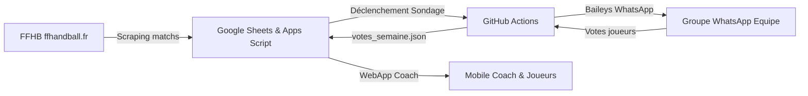
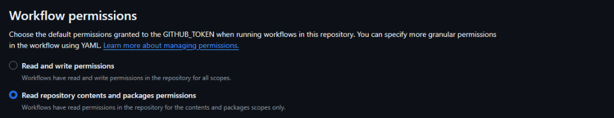

# 📖 Guide d'Installation Complet - Handball Bot

Ce guide pas à pas détaille comment installer, configurer et utiliser le **Handball Bot** pour votre club de handball.

---

## 🎯 Architecture générale

L'outil repose sur 3 composants entièrement **gratuits** et sans hébergement payant :

1. **Google Sheets** : Le tableau de bord central du club (configuration, effectif, votes de la semaine, historique des compositions).
2. **Google Apps Script & WebApp** : L'intelligence qui scrape les matchs de la FFHB, calcule les convocations et propose l'application mobile de composition (avec mode Tinder).
3. **GitHub Actions & Baileys** : Le robot WhatsApp qui s'exécute à la demande pour publier les sondages, envoyer les convocations et synchroniser les votes.



---

## 📋 Prérequis

Avant de commencer, munissez-vous de :
- Un compte **Google** (Gmail ou Google Workspace)
- Un compte **GitHub** (gratuit, sur [github.com](https://github.com))
- Un téléphone avec **WhatsApp** (numéro d'un coach, dirigeant ou numéro dédié au club)

---

## Étape 1 : Créer votre dépôt GitHub & Activer les permissions

1. Sur GitHub, utilisez ce template en cliquant sur le bouton vert **« Use this template »** > **« Create a new repository »** (ou dupliquez ce dossier dans un nouveau dépôt).
2. **Très important** : Choisissez la visibilité **Private** (Dépôt Privé).
   > [!IMPORTANT]
   > Le dépôt doit rester **Privé** afin de protéger la session WhatsApp de votre bot (`auth_info/`) ainsi que les numéros et votes de vos joueurs.

3. **Activer les permissions d'écriture pour GitHub Actions (Indispensable)** :
   Par défaut sur un nouveau dépôt, GitHub bride les automatisations en lecture seule. Pour que le robot puisse sauvegarder votre session WhatsApp (`auth_info/`), mettre à jour les scripts et enregistrer les votes :
   - Dans votre dépôt GitHub, cliquez sur l'onglet **Settings** (tout à droite).
   - Dans le menu de gauche, allez dans **Actions > General**.
   - Faites défiler jusqu'à la section **Workflow permissions** :
     - Cochez **« Read and write permissions »** (au lieu de *Read repository contents and packages permissions*).
     - Cochez également **« Allow GitHub Actions to create and approve pull requests »**.
   - Cliquez sur le bouton vert **Save**.



> [!WARNING]
> Sans cette case cochée, GitHub Actions rejettera la sauvegarde de votre session WhatsApp (`auth_info/`) et les votes reçus ne pourront pas être enregistrés sur le dépôt !

---

## Étape 2 : Mettre en place le Google Sheet

Vous avez deux méthodes au choix :

### Méthode A (Recommandée - Import direct du template Excel)
1. **Téléchargez le fichier modèle** :
   - Depuis votre dépôt GitHub, cliquez sur le fichier [`Handball_Bot_Template.xlsx`](Handball_Bot_Template.xlsx).
   - Cliquez sur le bouton de téléchargement **« Download raw file »** (icône ⬇️ en haut à droite) pour enregistrer le fichier sur votre ordinateur.
2. **Importez-le dans Google Drive** :
   - Ouvrez votre **Google Drive** ([drive.google.com](https://drive.google.com)).
   - Glissez-déposez le fichier `Handball_Bot_Template.xlsx` fraîchement téléchargé dans votre Google Drive (ou cliquez sur *Nouveau > Importer un fichier*).
3. **Convertissez-le au format Google Sheets** :
   - Double-cliquez sur le fichier pour l'ouvrir dans Google Drive.
   - Dans le menu supérieur, cliquez sur **Fichier > Enregistrer au format Google Sheets**.
   > *(Un nouveau classeur Google Sheets s'ouvre, c'est lui qui servira de tableau de bord)*.
4. **Installez le code du bot** :
   - Dans ce classeur Google Sheets, allez dans **Extensions > Apps Script**.
   - Supprimez le code par défaut, copiez l'intégralité du fichier [`code.gs`](code.gs) de ce dépôt et collez-le.
   - Cliquez sur l'icône de disquette 💾 pour enregistrer le projet Apps Script.
5. Rechargez la page de votre classeur Google Sheets : un menu **« ⚡ Handball Bot »** apparaît dans la barre d'outils.

### Méthode B (Création depuis une feuille vierge)
1. Créez un classeur vierge sur [sheets.new](https://sheets.new).
2. Allez dans **Extensions > Apps Script**.
3. Collez le code de [`code.gs`](code.gs), enregistrez et rechargez la feuille.
4. Cliquez sur le menu **« ⚡ Handball Bot » > « ✨ 6. Initialiser le classeur complet »** : tous les onglets, formules et styles sont créés automatiquement en 1 clic !

---

## Étape 3 : Créer un Token d'Accès GitHub (PAT)

Google Sheets a besoin d'un token pour communiquer avec votre dépôt GitHub (déclencher les sondages et lire les votes).

1. Sur GitHub, cliquez sur votre photo de profil en haut à droite > **Settings**.
2. Dans le menu de gauche tout en bas, cliquez sur **Developer Settings**.
3. Cliquez sur **Personal access tokens** > **Tokens (classic)**.
4. Cliquez sur **Generate new token** > **Generate new token (classic)**.
5. Remplissez le formulaire :
   - **Note** : `Handball Bot Token`
   - **Expiration** : `No expiration` (ou 1 an)
   - **Scopes (Permissions)** : Cochez impérativement la case principale **`repo`** (Full control of private repositories) ainsi que la case **`workflow`** (Update GitHub Action workflows).
6. Cliquez sur **Generate token** en bas de page.
7. **Copiez immédiatement le token généré** (qui commence par `ghp_...`).
8. Ouvrez votre Google Sheet, onglet **Configuration** :
   - Collez votre token en cellule **`C20`** (`Token GitHub (PAT)`).
   - Renseignez le nom de votre dépôt en cellule **`C19`** (ex : `mon-club/handball-bot`).

---

## Étape 4 : Première connexion WhatsApp & ID du Groupe

1. Rendez-vous sur votre dépôt GitHub, dans l'onglet **Actions**.
2. Dans la colonne de gauche, cliquez sur le workflow **WhatsApp Poll Bot**.
3. À droite, cliquez sur le bouton déroulant **Run workflow**.
4. Remplissez :
   - **Votre numéro de téléphone** : au format international sans `+` (ex : `33612345678`).
   - **Mode à lancer** : laissez sur **`setup`**.
5. Cliquez sur **Run workflow**.
6. Cliquez sur l'exécution qui démarre dans la liste, puis sur le job **run-whatsapp** pour afficher les logs en direct.
7. Au bout de 20 à 30 secondes, un message s'affiche :
   ```
   ====================================================
   CODE DE CONNEXION WHATSAPP : ABCD-1234
   Saisissez ce code dans WhatsApp > Appareils connectés > Associer avec numéro
   ====================================================
   ```
8. **Sur votre smartphone** :
   - Ouvrez WhatsApp > Réglages / Paramètres > **Appareils connectés**.
   - Cliquez sur **Associer un appareil**, puis choisissez **« Associer avec un numéro de téléphone »**.
   - Saisissez le code à 8 caractères affiché sur GitHub.
9. Une fois connecté, le script affiche la liste complète de vos groupes WhatsApp :
   ```
   ====================================================
   LISTE DES GROUPES WHATSAPP DISPONIBLES :
   Copiez l'ID de votre groupe dans votre Google Sheet (Configuration > C18) :
   ----------------------------------------------------
   Groupe : "Séniors 1 & 2 - Saison 2026/2027"  --->  ID : 120363400717460181@g.us
   ====================================================
   ```
10. Copiez l'ID du groupe souhaité (format `... @g.us`) et collez-le dans votre Google Sheet, onglet **Configuration**, cellule **`C18`** (`ID du Groupe WhatsApp`).

> [!TIP]
> GitHub Actions sauvegarde automatiquement la session WhatsApp dans le dossier `auth_info/` de votre dépôt. Vous n'aurez plus besoin de refaire cette association par la suite !

---

## Étape 5 : Configurer les équipes & URLs FFHB

Dans l'onglet **Configuration** de votre Google Sheet :

### 1. Informations du Club
- **Nom du Club** (`C22`) : ex. `HBC Nantes`, `US Ivry Handball`, etc.
- **Logo du Club (URL)** (`C23`) : Lien direct vers l'image de votre blason (facultatif).
- **Gymnase / Ville par défaut** (`C24`) : Le nom de votre salle pour les matchs à domicile.
- **Numéros Coachs / Admins** (`C25`) : Vos numéros au format international séparés par des virgules (ex: `33612345678,33698765432`). Les numéros renseignés ici ont accès à l'espace coach de la WebApp sans restriction.
- **Couleurs personnalisées du club** (au format hexadécimal `#RRGGBB`) :
  - **Couleur Principale** (`C26`) : Teinte majeure du club (en-tête, boutons d'action, accents). Ex: `#f97316` (Orange).
  - **Couleur Secondaire** (`C27`) : Teinte d'accentuation (boutons secondaires, dégradés). Ex: `#fbbf24` (Ambre).
  - **Couleur Équipe 1** (`C28`) : Couleur distinctive de l'équipe 1 (badges, colonne, maillot). Ex: `#3b82f6` (Bleu).
  - **Couleur Équipe 2** (`C29`) : Couleur distinctive de l'équipe 2. Ex: `#f97316` (Orange).
  - **Couleur Équipe 3** (`C30`) : Couleur distinctive de l'équipe 3. Ex: `#10b981` (Émeraude).

> [!TIP]
> **Personnalisation visuelle en 1 clic :**
> Vous pouvez aussi configurer vos couleurs directement depuis votre smartphone sur la WebApp (bouton **🎨 Couleurs** ou via le menu Coach **🎨 Couleurs & Identité du Club**).
> Un sélecteur interactif propose des palettes prêtes à l'emploi (HBC Nantes, PSG, Montpellier MHB, USAM Nîmes, Chambéry, etc.) avec aperçu en temps réel et sauvegarde automatique dans le Google Sheet !
> Si vous modifiez les couleurs directement dans la feuille Google Sheet, cliquez sur le menu **`⚡ Handball Bot` > `🎨 7. Actualiser les couleurs et styles`** pour recalculer les pastilles et la couleur des onglets.

### 2. Équipes & Poules FFHB (Lignes 4 à 6 - 3 équipes maximum)
Pour préserver une ergonomie optimale sur smartphone et un mode Tinder fluide, le système gère **jusqu'à 3 équipes maximum** (ex: SG1, SG2, SG3) :
- **Code équipe** (`Colonne B`) : ex. `Équipe 1`, `Équipe 2`, `Équipe 3`.
- **Nom recherché (Mot-clé FFHB)** (`Colonne C`) : Le nom de votre club tel qu'il apparaît sur le site de la FFHB (ex: `NANTES`, `IVRY`, `BOULOGNE`).
- **Libellé dans le sondage** (`Colonne D`) : L'appellation courte de l'équipe (ex: `SG1`, `SG2`, `SG3`, `N2`, `R1`, `-18M`).
- **Délai RDV avant match** (`Colonne E`) : Nombre d'heures de convocation avant le coup d'envoi (ex: `1` pour 1h avant, `1.5` pour 1h30).
- **URL de la poule FFHB** :
  1. Allez sur le site officiel [ffhandball.fr](https://www.ffhandball.fr).
  2. Naviguez vers **Compétitions** > Choisissez la division de votre équipe > Sélectionnez votre poule.
  3. Copiez l'URL de la page dans la barre d'adresse de votre navigateur (ex : `https://www.ffhandball.fr/competitions/saison-2026-2027-22/regional/regionale-3-masculine-32421/poule-190542/`).
  4. Collez cette URL dans la colonne **F**.

> [!IMPORTANT]
> **Mode Tinder adaptatif selon le nombre d'équipes configurées :**
> - **1 équipe** : 👈 Gauche = Repos | 👉 Droite = Sélectionné
> - **2 équipes** : 👈 Gauche = Équipe 1 | 👉 Droite = Équipe 2 | 👇 Bas = Repos
> - **3 équipes** : 👆 Haut = Équipe 1 | 👈 Gauche = Équipe 2 | 👉 Droite = Équipe 3 | 👇 Bas = Repos

### 3. Créneaux d'Entraînement (Lignes 9 à 14)
- Personnalisez l'intitulé de vos entraînements (jours, horaires, gymnase).
- Mettez **`OUI`** ou **`NON`** dans la colonne **Actif** pour inclure ou exclure un créneau du sondage WhatsApp hebdomadaire.

---

## Étape 6 : Remplir l'Effectif des Joueurs

Dans l'onglet **Effectif** :
- **Nom / Surnom** : Nom affiché dans la composition et les convocations.
- **Téléphone (format 336...)** : Numéro WhatsApp du joueur au format international (sans `+` ni espaces, ex: `33612345678`). C'est ce qui relie automatiquement son vote WhatsApp à sa fiche joueur.
- **Poste** : Gardien, Ailier Gauche, Arrière Gauche, Demi-Centre, Pivot, Arrière Droit, Ailier Droit.
- **Équipe habituelle** : ex. `SG1` ou `SG2`.
- **Photo** : URL d'une photo (ou lien Google Drive public). Les joueurs peuvent également ajouter leur photo directement depuis leur smartphone via la WebApp !
- **Code PIN** : Laissé vide au départ. Chaque joueur choisit son PIN à 4 chiffres lors de sa première connexion sur la WebApp.

---

## Étape 7 : Déployer la WebApp Mobile Coach & Joueurs

1. Dans votre Google Sheet, ouvrez **Extensions > Apps Script**.
2. En haut à droite, cliquez sur le bouton bleu **Déployer > Nouveau déploiement**.
3. À côté de « Sélectionner le type », cliquez sur l'engrenage ⚙️ et choisissez **Application Web**.
4. Remplissez les options :
   - **Description** : `Handball Bot v1`
   - **Exécuter en tant que** : **Moi (votre adresse email)**
   - **Qui a accès** : **Tout le monde (Anyone)**
5. Cliquez sur **Déployer**.
6. Donnez les autorisations d'accès Google si demandées.
7. **Copiez l'URL de l'application Web** qui vous est fournie (se terminant par `/exec`).
8. Collez cette URL dans votre Google Sheet, onglet **Configuration**, cellule **`C21`** (`URL WebApp (Auto)`).

> [!TIP]
> Vous pouvez raccourcir cette URL sur un service comme [tinyurl.com](https://tinyurl.com) (ex: `tinyurl.com/mon-club-coach`) pour la partager facilement dans la description du groupe WhatsApp de l'équipe !

---

## Étape 8 : Tester le Bot et l'Envoi WhatsApp

1. Dans votre Google Sheet, cliquez sur le menu **« ⚡ Handball Bot » > « 🔄 1. Mettre à jour les matchs FFHB et l'aperçu »**.
   - Le script consulte automatiquement la FFHB et détecte le match de la semaine pour chaque équipe.
   - Consultez l'onglet **Matchs FFHB Détectés** et l'onglet **Aperçu Sondage WhatsApp** pour vérifier le résultat.
2. Cliquez sur **« ⚡ Handball Bot » > « 📤 2. Envoyer le sondage sur WhatsApp (GitHub) »**.
   - Google Sheets déclenche GitHub Actions.
   - En quelques secondes, le sondage officiel est publié dans votre groupe WhatsApp !
3. Les joueurs votent directement dans le groupe WhatsApp.
4. Les votes sont récupérés automatiquement toutes les heures par GitHub Actions. Vous pouvez forcer la lecture à tout moment via **« 📥 3. Récupérer les votes WhatsApp »** puis **« ⚡ 4. Importer les votes depuis GitHub »**.

---

## Étape 9 : Automatisation du Lundi Matin (Optionnel)

Pour que le sondage parte automatiquement chaque lundi sans intervention humaine :

1. Dans votre Google Sheet, ouvrez **Extensions > Apps Script**.
2. Dans le menu de gauche, cliquez sur l'icône de réveil ⏰ (**Déclencheurs** / Triggers).
3. Cliquez sur **+ Ajouter un déclencheur** en bas à droite :
   - Fonction à exécuter : **`executionAutoLundiMatin`**
   - Source de l'événement : **Déclencheur temporel**
   - Type de déclencheur basé sur l'heure : **Minuteur hebdomadaire**
   - Jour de la semaine : **Chaque lundi**
   - Heure de la journée : **De 7h à 8h** (ou l'heure de votre choix)
4. Cliquez sur **Enregistrer**.

Le lundi matin à l'heure choisie, le robot analysera les matchs FFHB et enverra le sondage aux joueurs en totale autonomie !

---

## 🛠️ Dépannage & Questions Fréquentes

### WhatsApp a été déconnecté (Erreur 401 ou déconnexion du smartphone)
Si vous dissociez l'appareil dans WhatsApp ou si la session expire :
1. Allez dans GitHub Actions > **WhatsApp Poll Bot** > **Run workflow**.
2. Saisissez votre numéro de téléphone et lancez en mode **`setup`**.
3. Entrez le nouveau code de liaison sur WhatsApp.

### Erreur « Resource not accessible by integration » sur GitHub Actions
Assurez-vous que les permissions des workflows sont activées en écriture sur votre dépôt :
1. Sur votre dépôt GitHub, allez dans **Settings > Actions > General**.
2. Dans la section **Workflow permissions**, cochez **« Read and write permissions »**.
3. Cochez également **« Allow GitHub Actions to create and approve pull requests »**.
4. Cliquez sur **Save**.

### Erreur « refusing to allow a GitHub App to create or update workflow without workflows permission » ou « Unexpected value 'workflows' »
Cette situation survient si votre action de synchronisation tente de commiter des modifications dans le dossier `.github/workflows/` :
1. **Règle de sécurité GitHub** : Le jeton par défaut `GITHUB_TOKEN` est strictement interdit par GitHub de modifier ou commiter des fichiers de workflows (pour empêcher toute injection de code malveillant ou boucle infinie).
2. **Ne pas écrire `workflows: write` dans le YAML** : Dans la syntaxe GitHub Actions, la clé `workflows` n'existe pas dans le bloc `permissions:` (seules `contents`, `actions`, `pull-requests`, etc. sont acceptées). Écrire `workflows: write` provoque l'erreur `Unexpected value 'workflows'`.
3. **Comment résoudre :**
   * **Solution 1 (Standard & Recommandée)** : Synchronisez uniquement les fichiers applicatifs (`send-poll.js`, `package.json`, `version.json`, documentation) comme le fait le template officiel. Ces fichiers se mettent à jour parfaitement avec `contents: write`.
   * **Solution 2 (Mettre aussi à jour les workflows)** : Utilisez un Personal Access Token (PAT) avec le scope `workflow` configuré dans vos Secrets (voir détails à l'Étape 10 ci-dessous).

### La WebApp affiche une erreur d'autorisation
Lors du déploiement de la WebApp :
- Choisissez toujours **Exécuter en tant que : Moi** et **Qui a accès : Tout le monde**.
- Si vous modifiez le code `code.gs`, pensez à faire **Déployer > Gérer les déploiements > Modifier (crayon) > Nouvelle version > Déployer** pour que les changements soient pris en compte.

---

## Étape 10 : Mettre à jour votre Bot lors des nouvelles versions

Lorsqu'une nouvelle version de Handball Bot est publiée avec de nouvelles fonctionnalités ou des correctifs, vous en êtes automatiquement averti :
- **Sur l'accueil Coach de la WebApp** : Un bandeau violet vous indique la nouvelle version disponible et affiche la liste des nouveautés.
- **Dans Google Sheets** : Le menu **`⚡ Handball Bot` > `🔄 8. Vérifier les mises à jour du modèle`** vous donne les détails et liens directs.

### 1. Mettre à jour le robot WhatsApp (GitHub Actions) en 1 clic

#### Méthode Standard (Recommandée) :
1. Sur votre dépôt GitHub privé, rendez-vous dans l'onglet **Actions**.
2. Dans la colonne de gauche, cliquez sur le workflow **« Sync with Handball Bot Template »**.
3. À droite, cliquez sur **Run workflow** > **Run workflow**.
4. En 10 secondes, GitHub télécharge les nouveaux scripts applicatifs (`send-poll.js`, `package.json`, `version.json`, guides) et les applique à votre dépôt **sans jamais toucher à votre session WhatsApp (`auth_info/`)**.

#### Option Avancée : Si vous souhaitez que le bot mette aussi à jour les fichiers de workflow (`.github/workflows/`)

Puisque le `GITHUB_TOKEN` par défaut ne peut pas modifier les workflows, il faut utiliser un **Personal Access Token (PAT)** avec le droit `workflow` :

1. **Créer le token PAT** :
   - Dans vos paramètres GitHub : **Settings > Developer Settings > Personal access tokens > Tokens (classic)**.
   - Cliquez sur **Generate new token (classic)**.
   - Cochez impérativement :
     - **`repo`** (Full control of private repositories)
     - **`workflow`** (Update GitHub Action workflows)
   - Cliquez sur **Generate token** et copiez le token (`ghp_...`).
2. **Ajouter le Secret sur le dépôt de votre club** :
   - Sur votre dépôt GitHub, allez dans **Settings > Secrets and variables > Actions**.
   - Cliquez sur **New repository secret** :
     - Nom : **`GH_PAT`**
     - Valeur : collez votre token `ghp_...`
3. **Configurer votre workflow `.github/workflows/sync-template.yml`** :
   - Utilisez ce token dans l'étape de récupération (checkout) :
     ```yaml
     permissions:
       contents: write

     jobs:
       sync-template:
         runs-on: ubuntu-latest
         steps:
           - name: Récupération du dépôt du club
             uses: actions/checkout@v4
             with:
               token: ${{ secrets.GH_PAT }}
               fetch-depth: 0
     ```

> [!IMPORTANT]
> **Attention à la syntaxe YAML :** Ne mettez **JAMAIS** `workflows: write` dans le bloc `permissions:`. Le mot-clé `workflows` n'existe pas dans GitHub Actions et provoquera l'erreur `Unexpected value 'workflows'`. L'autorisation de mettre à jour les workflows est apportée exclusivement par le jeton `${{ secrets.GH_PAT }}` transmis à l'action de checkout.

### 2. Mettre à jour le Google Sheet (`code.gs`)
1. Dans votre Google Sheet, ouvrez **Extensions > Apps Script**.
2. Supprimez l'ancien contenu de `code.gs` et collez la nouvelle version.
3. Cliquez sur la disquette 💾 pour enregistrer.
4. Cliquez sur **Déployer > Gérer les déploiements > Modifier (icône crayon)**.
5. Dans **Version**, choisissez **Nouvelle version**, puis cliquez sur **Déployer**.

> [!NOTE]
> **Vos données sont 100% en sécurité :**
> Vos effectifs, numéros, créneaux, URLs FFHB et palettes de couleurs sont stockés dans les cellules de vos feuilles Google Sheets. La mise à jour de `code.gs` ne touche à aucune de vos données !


