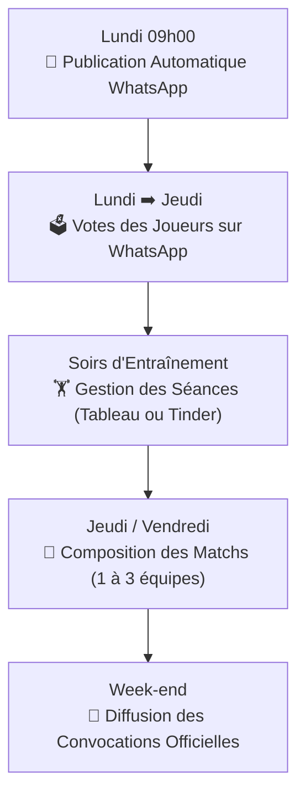

# 📖 Guide d'Utilisation au Quotidien - Handball Bot

Bienvenue dans le guide pratique d'utilisation de **Handball Bot** !  
Ce document détaille le fonctionnement de l'application dans la vie de tous les jours pour les **entraîneurs** et les **joueurs**.

> [!TIP]
> Pour une présentation complète, visuelle et synthétique de toutes les options disponibles (Terrain 2D, Mode Tinder, Renforts, Joueurs au repos, PWA, Chiffrement...), consultez également le **[🌟 Guide Complet des Fonctionnalités Coach (FONCTIONNALITES.md)](FONCTIONNALITES.md)**.

---

## 📅 Le Rythme Hebdomadaire d'une Saison

---

## 📲 Côté Joueurs : Simple, Rapide et sans Application

Les joueurs n'ont rien à installer : tout se passe via **WhatsApp** et un **Portail Web mobile** très léger.

### 1. Voter au sondage WhatsApp
- Chaque lundi matin, le bot publie automatiquement le sondage dans le groupe de l'équipe.
- Le joueur sélectionne en 2 secondes :
  - Ses disponibilités pour les matchs du week-end (*ex: SG1, SG2, SG3*).
  - Ses présences aux entraînements de la semaine (*Lundi, Mercredi, Jeudi*).
- S'il a un imprévu, il peut modifier son vote à tout moment sur WhatsApp avant la clôture.

### 2. Accéder à son Portail Joueur personnel
1. Le joueur ouvre le lien de la WebApp sur son smartphone.
2. Il entre son **numéro de téléphone** (format `06...`).
3. **Première connexion** : il choisit son **Code PIN secret** (4 à 8 chiffres).
4. Il accède à sa fiche personnalisée :
   - 🤾 **Choix de son poste de prédilection** (*Gardien, Demi-Centre, Pivot, Ailiers, Arrières*).
   - 📷 **Photo de profil** : il clique pour prendre un selfie ou choisir une photo dans sa galerie (la photo apparaîtra ensuite sur sa carte de composition et son badge de match !).

---

## 👑 Côté Entraîneurs : Le Dashboard Coach

Pour accéder aux fonctions coach :
1. Sur la page d'accueil de la WebApp, connectez-vous avec votre numéro (qui doit être répertorié dans la cellule `Configuration!C25` ou dans l'Effectif avec un poste d'entraîneur).
2. Le bandeau **👑 Espace Coach Déverrouillé** apparaît avec votre tableau de bord interactif.

---

## 🏋️ 1. Gérer les Séances d'Entraînement

La WebApp s'adapte à la réalité du terrain et supporte **3 types de séances** :

| Type de Séance | Description | Exemple type | Mode Tinder |
| :--- | :--- | :--- | :--- |
| **🔀 Entraînement Séparé** | Répartition des joueurs en 2 groupes distincts | Lundi (ex: SG1 vs SG2 ou Avants vs Arrières) | 👈 Groupe 1 / 👉 Groupe 2 / 👇 Repos |
| **🎯 Effectif Réduit** | Sélection d'un nombre limité de joueurs avec quota max | Jeudi (séance tactique max 18-20 joueurs) | 👈 Repos / 👉 Retenu |
| **👥 Effectif Complet** | Tous les joueurs disponibles sont retenus ensemble | Mercredi (séance ouverte à tous les présents) | 👈 Repos / 👉 Retenu |

### Comment procéder :
1. Cliquez sur **🏋️ Séances d'Entraînement** sur l'accueil.
2. Choisissez l'onglet du jour : **Lundi**, **Mercredi** ou **Jeudi**.
3. Choisissez le mode de travail souhaité :
   - **📋 Mode Tableau (Glisser-Déposer)** : Glissez les cartes des joueurs disponibles vers les groupes.
   - **🔥 Mode Tinder (Swipe Cartes)** : Swipez les cartes à la chaîne sur votre téléphone !
4. Cliquez sur **👁 Preview WhatsApp** :
   - La convocation d'entraînement est générée avec les compteurs et listes de joueurs.
   - Vous pouvez ajuster le texte, puis cliquer sur **📤 Publier sur WhatsApp** pour l'envoyer directement dans le groupe du club !
5. Cliquez sur **💾 Sauvegarder** pour enregistrer la séance dans l'historique Google Sheets.

---

## 🤾 2. Composer les Équipes de Match (1, 2 ou 3 Équipes)

Le bot gère de **1 à 3 équipes** configurées dans votre club (*ex: Équipe 1, Équipe 2, Équipe 3*).

### Le Mode Tinder à Cartes Swipables :
Le geste tactile s'adapte automatiquement à votre nombre d'équipes :

- **1 équipe configurée** :
  - 👈 Gauche = 😴 Repos / Non retenu
  - 👉 Droite = 🤾 Sélectionné dans l'Équipe 1
- **2 équipes configurées** :
  - 👈 Gauche = 🟡 Équipe 1
  - 👉 Droite = 🟢 Équipe 2
  - 👇 Bas = 😴 Repos / Non retenu
- **3 équipes configurées** :
  - 👆 Haut = 🟡 Équipe 1
  - 👈 Gauche = 🟢 Équipe 2
  - 👉 Droite = 🔵 Équipe 3
  - 👇 Bas = 😴 Repos / Non retenu

### Le Mode Tableau :
- Disposez vos colonnes d'équipes et votre vivier de joueurs disponibles.
- Les badges de présence indiquent le nombre d'entraînements effectués dans la semaine et le poste du joueur.
- Cliquez sur ✏️ sur n'importe quel joueur pour ajouter une note tactique privée ou modifier sa photo.

### Publication de la Convocation Officielle :
1. Cliquez sur **👁 Preview du message**.
2. Le message officiel est généré automatiquement avec :
   - Les adversaires, gymnases et heures de coup d'envoi détectés sur le site FFHB.
   - Les heures précises de rendez-vous calculées selon votre délai configuré.
   - La liste ordonnée des joueurs convoqués par équipe.
3. Cliquez sur **📤 Publier sur WhatsApp** : la convocation part instantanément dans le groupe !

---

## 🎨 3. Personnaliser le Blason et les Couleurs du Club

Le coach peut à tout moment changer l'identité visuelle du club directement depuis son smartphone :

1. Cliquez sur **🎨 Identité & Blason du Club**.
2. **Logo / Blason du club** :
   - Cliquez sur **📷 Importer une image** pour sélectionner le blason officiel depuis votre galerie ou ordinateur.
   - L'image est automatiquement enregistrée et optimisée sur votre Google Drive.
   - Tous les en-têtes de l'application s'actualisent instantanément !
3. **Couleurs des maillots** :
   - Choisissez les couleurs de votre club et les couleurs spécifiques pour les maillots de l'Équipe 1, l'Équipe 2 et l'Équipe 3.
   - Des palettes prédéfinies de grands clubs (*Nantes, PSG, Montpellier, USAM, etc.*) sont disponibles en 1 clic.

---

## 👥 4. Gérer l'Effectif, les Postes et les Notes Tactiques

Dans l'onglet **👥 Effectif & Notes** :
- Retrouvez l'ensemble des joueurs du club sous forme de trombinoscope.
- Cliquez sur un joueur pour :
  - Définir son poste principal.
  - Téléverser sa photo officielle s'il ne l'a pas fait lui-même.
  - Écrire une **note confidentielle d'entraîneur** (*ex: "Retour de blessure cheville", "Capitaine", "À tester ailier gauche"*). Cette note apparaîtra sur sa carte lors de vos compositions !

---

## 💡 Conseils & Astuces

- **Actualisation des votes** : Si un joueur vote en retard sur WhatsApp, cliquez sur le bouton **📥 Actualiser WhatsApp** dans l'en-tête pour synchroniser les nouveaux votes sans quitter la page.
- **Mises à jour du code** : Si une nouvelle version de Handball Bot sort, une notification s'affiche sur votre accueil. Vous pouvez synchroniser le robot en 1 clic via GitHub Actions.

